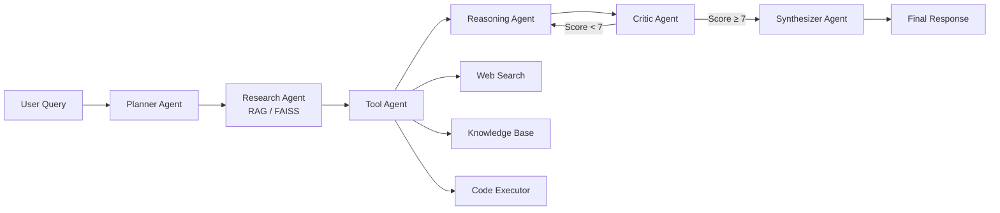

# Multi-Agent AI Research & Reasoning Platform

A production-ready backend system implementing a multi-agent architecture for
AI-powered research, reasoning, and knowledge retrieval. Built with FastAPI,
LangChain, Groq LLM, FAISS vector store, and HuggingFace embeddings.

## Architecture



### Agent Pipeline

| # | Agent | Responsibility |
|---|-------|---------------|
| 1 | **Planner** | Decomposes query into structured execution steps |
| 2 | **Research** | Retrieves relevant passages from FAISS knowledge base |
| 3 | **Tool** | Selects & invokes tools (web search, RAG, code execution) |
| 4 | **Reasoning** | Performs chain-of-thought analysis across all gathered data |
| 5 | **Critic** | Evaluates quality, detects hallucinations, triggers retries |
| 6 | **Synthesizer** | Produces final polished answer combining all outputs |

### Key Features

- **Retry mechanism**: Critic agent gates output quality; poor answers are re-reasoned up to N times
- **Query caching**: LRU cache with TTL avoids redundant pipeline executions
- **Conversation memory**: Sliding-window context shared across agent calls
- **Safe code execution**: AST-based sandbox blocks dangerous imports/operations
- **Async throughout**: All agent calls use `async/await` with timeout protection

---

## Quick Start

### Prerequisites

- Python 3.10+
- A [Groq API key](https://console.groq.com/) (free tier available)

### 1. Clone & Setup

```bash
cd backend

# Create virtual environment
python -m venv .venv
source .venv/bin/activate  # macOS/Linux
# .venv\Scripts\activate   # Windows

# Install dependencies
pip install -r requirements.txt
```

### 2. Configure Environment

```bash
cp .env.example .env
# Edit .env and set your GROQ_API_KEY
```

### 3. Run the Server

```bash
uvicorn app.main:app --reload --host 0.0.0.0 --port 8000
```

The first startup will download the HuggingFace embedding model (~90 MB). Subsequent starts are instant.

### 4. Verify

```bash
curl http://localhost:8000/health
```

---


## API Reference

### `POST /query`

Process a user query through the full agent pipeline.

**Request:**
```json
{
  "query": "What are the key differences between transformers and RNNs in NLP?"
}
```

**Response:**
```json
{
  "query": "What are the key differences between transformers and RNNs in NLP?",
  "plan": "Analyze architectures and compare...\n1. Research transformer architecture\n2. Research RNN architecture\n3. Compare strengths and weaknesses\n4. Synthesize findings",
  "research_context": "Retrieved passages from knowledge base...",
  "tool_results": "[✓] web_search: 1. **Transformers vs RNNs**...",
  "reasoning": "After analyzing both architectures, transformers offer superior parallelization...",
  "critic_feedback": "Score: 8.5/10 – Well-structured comparison with good technical depth.",
  "answer": "Transformers and RNNs differ fundamentally in how they process sequential data...",
  "retries_used": 0,
  "cached": false,
  "processing_time_seconds": 12.345
}
```

### `POST /upload`

Upload a document into the knowledge base.

**Request:** `multipart/form-data` with a file field.

```bash
curl -X POST http://localhost:8000/upload \
  -F "file=@research_paper.pdf"
```

**Response:**
```json
{
  "filename": "research_paper.pdf",
  "chunks_created": 42,
  "message": "Successfully ingested 'research_paper.pdf' into the knowledge base (42 chunks)."
}
```

### `GET /health`

System health check.

**Response:**
```json
{
  "status": "healthy",
  "timestamp": "2025-01-15T10:30:00.000000+00:00",
  "components": {
    "orchestrator": "ready",
    "vector_store": "empty",
    "document_processor": "ready"
  }
}
```

---

## Environment Variables

| Variable | Default | Description |
|----------|---------|-------------|
| `GROQ_API_KEY` | *(required)* | Your Groq API key |
| `GROQ_MODEL` | `llama-3.3-70b-versatile` | Groq model identifier |
| `LLM_TEMPERATURE` | `0.1` | LLM sampling temperature |
| `LLM_MAX_TOKENS` | `4096` | Maximum tokens per LLM response |
| `EMBEDDING_MODEL` | `sentence-transformers/all-MiniLM-L6-v2` | HuggingFace embedding model |
| `MEMORY_SIZE` | `10` | Number of conversation turns to retain |
| `MAX_RETRIES` | `2` | Max Reasoning→Critic retry cycles |
| `CRITIC_THRESHOLD` | `7.0` | Minimum critic score to accept (1-10) |
| `AGENT_TIMEOUT` | `60` | Seconds before an agent call times out |
| `CACHE_SIZE` | `100` | Max cached query responses |
| `CACHE_TTL` | `300` | Cache entry lifetime in seconds |
| `CODE_EXEC_TIMEOUT` | `5` | Max seconds for code execution sandbox |
| `LOG_LEVEL` | `INFO` | Logging verbosity |

---

## Project Structure

```
backend/
├── app/
│   ├── __init__.py
│   ├── main.py                   # FastAPI app & lifespan startup
│   ├── api/
│   │   ├── __init__.py
│   │   └── routes.py             # /query, /upload, /health endpoints
│   ├── agents/
│   │   ├── __init__.py
│   │   ├── base.py               # Abstract BaseAgent class
│   │   ├── planner.py            # PlannerAgent
│   │   ├── research.py           # ResearchAgent (RAG)
│   │   ├── tool_agent.py         # ToolAgent
│   │   ├── reasoning.py          # ReasoningAgent
│   │   ├── critic.py             # CriticAgent
│   │   └── synthesizer.py        # SynthesizerAgent
│   ├── tools/
│   │   ├── __init__.py
│   │   ├── web_search.py         # DuckDuckGo search
│   │   ├── knowledge.py          # FAISS retrieval
│   │   └── code_executor.py      # Safe Python sandbox
│   ├── rag/
│   │   ├── __init__.py
│   │   ├── embeddings.py         # HuggingFace embedding manager
│   │   ├── vector_store.py       # FAISS vector store manager
│   │   └── document_processor.py # PDF/text ingestion & chunking
│   ├── core/
│   │   ├── __init__.py
│   │   ├── orchestrator.py       # Pipeline orchestrator
│   │   ├── cache.py              # LRU query cache with TTL
│   │   └── models.py             # Pydantic schemas
│   ├── memory/
│   │   ├── __init__.py
│   │   └── conversation.py       # Sliding-window conversation memory
│   └── config/
│       ├── __init__.py
│       └── settings.py           # Environment-based settings
├── data/
│   └── faiss_index/              # Persisted vector index (auto-created)
├── uploads/                      # Uploaded documents (auto-created)
├── .env.example                  # Environment variable template
├── requirements.txt
└── README.md
```

---

## License

MIT
