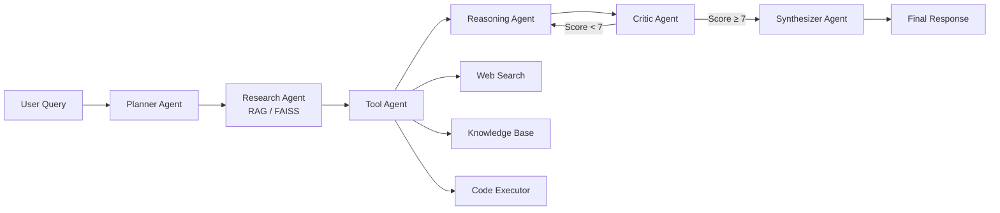

<div align="center">
  
# Multi-Agent AI Knowledge & Decision System

A production-ready backend system implementing a sophisticated multi-agent architecture for AI-powered research, reasoning, and knowledge retrieval. 

[](https://python.org)
[](https://fastapi.tiangolo.com/)
[](https://langchain.com/)
[](https://groq.com/)
[](#)
[](https://huggingface.co/)

</div>

---

## 📖 Case Study: The Problem & Our Solution

### The Use Case
As Large Language Models (LLMs) become more integrated into enterprise workflows, two major issues consistently arise: **Hallucinations** and **Superficiality**. Single-prompt LLMs often guess answers when they lack data, fail to verify their own logic, or provide shallow responses to complex, multi-layered questions. 

There is a critical need for an AI system that doesn't just "guess" an answer, but actually **researches, reasons, and verifies** its own work before presenting it to the user.

### What We Do
This project introduces a **Multi-Agent Architecture** designed to mimic a human research team. Instead of passing a user's query to a single AI, the query is routed through a specialized pipeline of autonomous agents, each with a distinct role. 

Our system:
1. **Plans** the execution steps required to solve the problem.
2. **Routes** simple queries to an immediate fast-path, while sending complex queries deep into the research pipeline.
3. **Researches** internal vector databases (RAG) and **Uses Tools** (live web search, Python code execution) concurrently.
4. **Reasons** step-by-step through the gathered evidence.
5. **Critiques** its own reasoning. A dedicated *Critic Agent* acts as a strict quality assurance checker. If the reasoning contains hallucinations or logical flaws, the Critic rejects it and forces the system to try again.
6. **Synthesizes** the verified data into a highly polished, heavily researched final response.

---

## 🧠 System Architecture



### The Agent Team
| Agent | Responsibility |
|-------|---------------|
| 🚦 **Router** | Analyzes query complexity. Bypasses the pipeline for simple questions to reduce latency. |
| 📋 **Planner** | Decomposes complex queries into structured, logical execution steps. |
| 📚 **Research** | Retrieves relevant passages from the local FAISS knowledge base (RAG). |
| 🛠️ **Tool** | Selects & invokes external tools (Tavily Web Search, Code Execution sandbox). |
| 🧠 **Reasoning** | Performs chain-of-thought analysis across all gathered data. |
| ⚖️ **Critic** | Evaluates quality, detects hallucinations, and triggers retries if accuracy is lacking. |
| ✍️ **Synthesizer**| Produces the final polished answer, citing sources and summarizing key points. |

---

## 🛠️ Technology Stack

- **[Python 3.10+](https://python.org)**: Core language programming.
- **[FastAPI](https://fastapi.tiangolo.com/)**: High-performance asynchronous web framework for serving the REST API.
- **[LangChain](https://langchain.com/)**: Framework for LLM orchestration and prompt management.
- **[Groq](https://groq.com/)**: Ultra-fast LPU inference engine powering the LLM agents (using Llama-3 models).
- **[FAISS (Facebook AI Similarity Search)](https://github.com/facebookresearch/faiss)**: Local vector database for extremely fast semantic retrieval.
- **[HuggingFace Transformers](https://huggingface.co/)**: Local embedding generation (`all-MiniLM-L6-v2`) for Document RAG.
- **[Tavily API](https://tavily.com/)**: High-quality, AI-optimized real-time web search integration.
- **[Uvicorn](https://www.uvicorn.org/)**: Lightning-fast ASGI web server.

---

## 🚀 Key Technical Features

- **Smart Routing & Concurrency**: Reduced latency by running `Research` and `Tool` agents asynchronously (`asyncio.gather`), while the `Router` dynamically skips heavy agents if the query is simple.
- **Self-Healing Retry Mechanism**: The Critic agent gates output quality. Poor or hallucinated answers are rejected and re-reasoned automatically up to a maximum retry limit.
- **Query Caching**: LRU cache with TTL completely avoids redundant pipeline executions for duplicate queries.
- **Conversation Memory**: Sliding-window context is shared across agent calls to maintain multi-turn conversational awareness.
- **Safe Code Execution**: AST-based sandbox blocks dangerous imports and system operations, allowing the AI to safely compute math or run logic.

---

## ⚡ Quick Start

### Prerequisites
- Python 3.10+
- A [Groq API key](https://console.groq.com/) (free tier available)
- A [Tavily API key](https://tavily.com/) (for web search)

### 1. Clone & Setup

```bash
# Create virtual environment
python -m venv .venv
source .venv/bin/activate  # macOS/Linux
# .venv\Scripts\activate   # Windows

# Install dependencies
pip install -r requirements.txt
```

### 2. Configure Environment

Copy `.env.example` to `.env` and fill in your keys:

```bash
GROQ_API_KEY=gsk_your_key_here
GROQ_MODEL=llama-3.1-8b-instant
TAVILY_API_KEY=tvly-your_key_here
```

### 3. Run the Server

```bash
uvicorn app.main:app --reload --host 0.0.0.0 --port 8000
```
*Note: The first startup will download the HuggingFace embedding model (~90 MB).*

---

## 🤝 Contributors

**[Pradeesh1108](https://github.com/Pradeesh1108)** - *Lead Developer & Architect*

---
